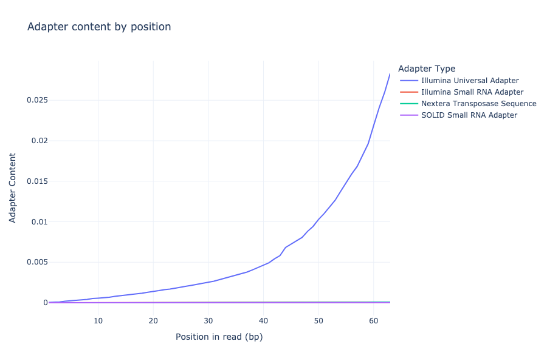
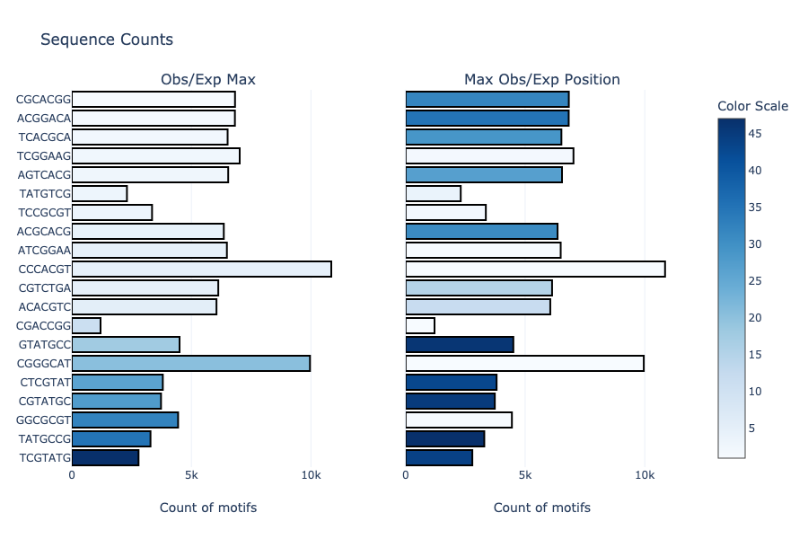
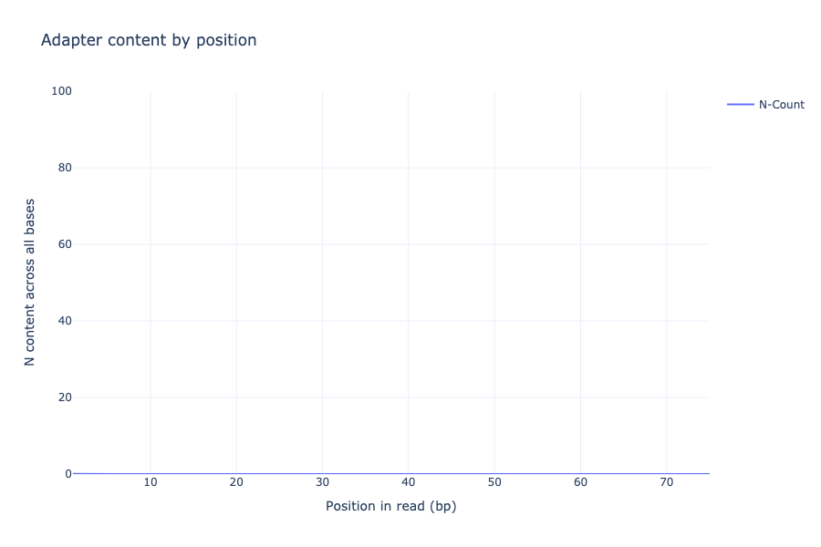
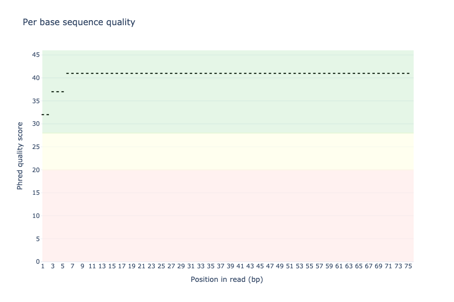
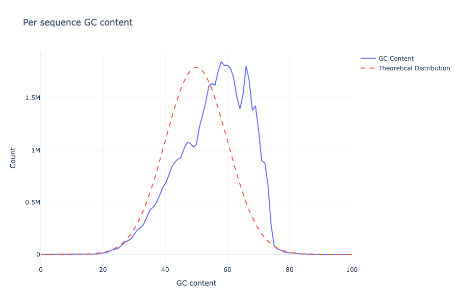
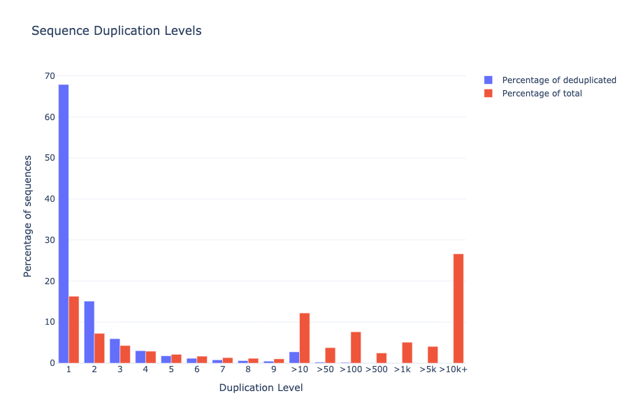

# FastQCParser

## FastQCParser User Guide:

***
It is recommended to open this via browser: <a href="https://ms2206.github.io/FastQCParser">User Guide</a>
***

## Introduction
A Python program to parse FastQCtext files, and generate reports and plots.

1. Clone directory: `git clone https://github.com/ms2206/FastQCParser.git`
2. Make a new python environment based from requirments.yaml `conda env create -f requirements.yaml --<NAME>`
3. Load environment <NAME> env. `conda activate <NAME>`
4. Change directory into FastQCParser
5. Example Usage: `python3 src/main.py data/raw/fastqc_data2.txt fastqc_2 -a`

-- plots are downloaded to the users `~/Downloads/` folder.
***
## Set up
Example Usage:
With python3, run executable found at `src/main.py`.

Pass `data/raw/fastqc_data2.txt` (or any fastqc file) - as input file, and `fastqc_2` as
output directory (or use a customer directory name).

Use optional argument `-a`.

`python3 src/main.py <FASTQ FILE> <DIR_NAME> [<OPTIONAL_ARGS>]`

`python3 src/main.py data/raw/fastqc_data2.txt fastqc_2 -a`

***
## Optional Args
Help and misc information provided by ArgeParse for optional arguments.  

`python3 src/main.py -h`

***
## Example Plots
### Adapter Content
Plot's adapter content by position.

### Kmer Content
Plot's kmer content by position.

### Overrepresented sequences
Plot's Per base N content.

### Per base sequence content
Plot's Per base sequence content.

### Per sequence quality scores
Plot's Per sequence quality scores.

### Per sequence GC content
Plot's Per sequence GC content.

### Per sequence quality scores
Plot's Per sequence quality scores.

### Per tile sequence quality
Plot's Per tile sequence quality.

### Sequence Duplication Levels
Plot Sequence Duplication Levels.

***
## GitHub
<https://github.com/ms2206/FastQCParser.git>