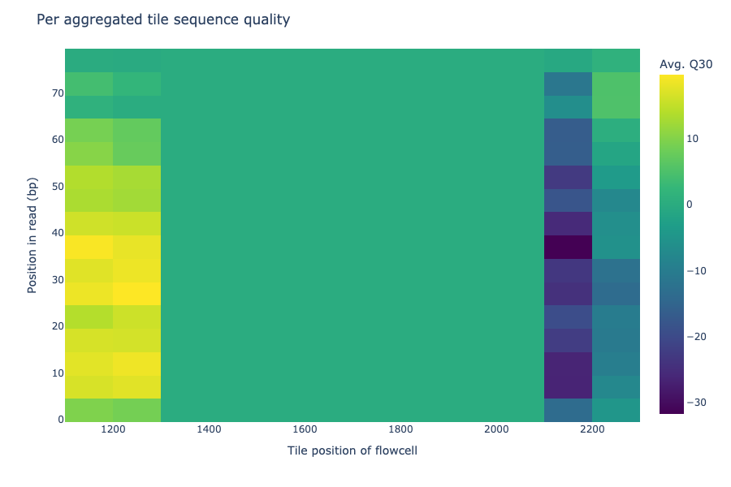

# FastQCParser User Guide:
***
## Introduction
A Python program to parse FastQCtext files, and generate reports and plots. 

1. Clone directory: `git clone https://github.com/ms2206/FastQCParser.git`
2. Make a new python environment based from requirments.yaml `conda env create -f requirements.yaml --<NAME>`
3. Load environment <NAME> env. `conda activate <NAME>`
3. Change directory into FastQCParser
4. Example Usage: `python3 src/main.py data/raw/fastqc_data2.txt fastqc_2 -a`
***
## Set up
Example Usage:
With python3, run executable found at src/main.py, pass in data/raw/fastqc_data2.txt - as input file, and fastqc_2 as
output directory. Use optional argument `-a`.

`python3 src/main.py data/raw/fastqc_data2.txt fastqc_2 -a`

***
## Optional Args
Help and misc information provided by ArgeParse for optional arguments. 

***
## Example Plots
### Adapter Content
Plot's adapter content by position.

### Kmer Content
Plot's kmer content by position.

### Overrepresented sequences
Plot's Per base N content.

### Per base sequence content
Plot's Per base sequence content.

### Per sequence quality scores
Plot's Per sequence quality scores.

### Per sequence GC content
Plot's Per sequence GC content.

### Per sequence quality scores
Plot's Per sequence quality scores.

### Per tile sequence quality
Plot's Per tile sequence quality.

### Sequence Duplication Levels
Plot Sequence Duplication Levels.

***
## GitHub
<https://github.com/ms2206/FastQCParser.git>